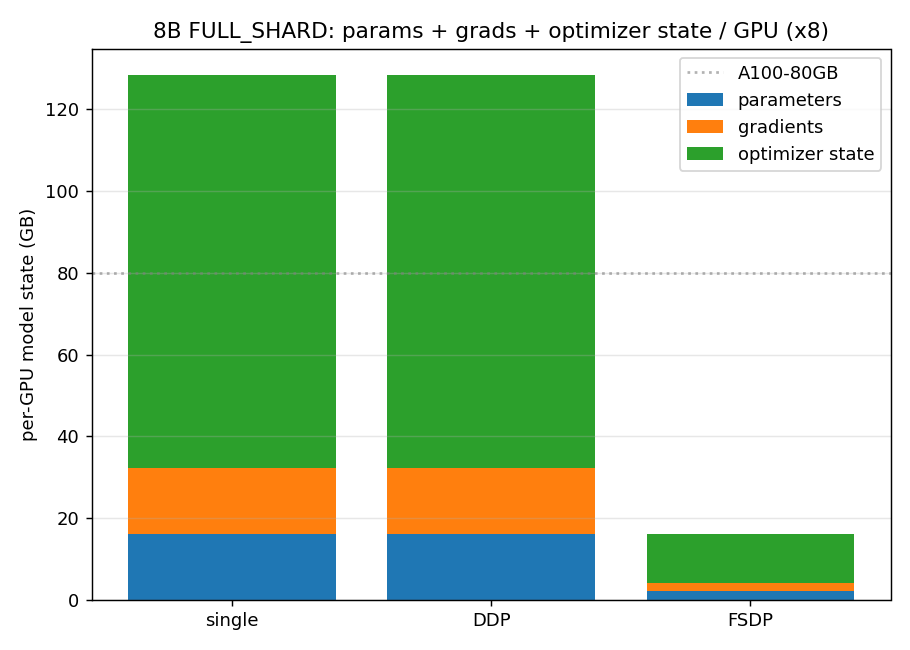
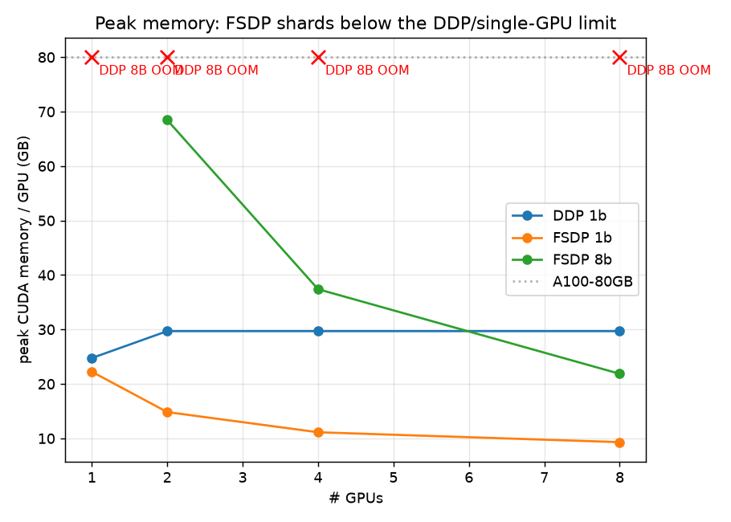

# distbench

A PyTorch benchmark for Llama 8B-class distributed training. It scales from
single-GPU profiling to multi-GPU DDP and FSDP, and quantifies the tradeoffs
between the two across throughput, scaling efficiency, GPU utilization, NCCL
communication overhead, and peak CUDA memory.

I built it to actually understand distributed training rather than read about it,
so the same code runs in three places: my laptop for correctness, a single Colab
A100 for profiling, and an 8x A100 box for the real numbers. One trainer, one set
of launch scripts, no rewrite between "learning" and "results".

The model is HuggingFace transformers' official `LlamaForCausalLM` at the exact
Llama-3.1-8B config (`--impl hf`, the default). Because this is a throughput and
memory benchmark, the weight *values* do not matter: FLOPs, activation memory,
parameter/gradient/optimizer memory, and communication volume depend only on the
model shape and dtype. So it runs with random init and synthetic tokens by
default (no gated download, identical numbers), and `--hf-pretrained` loads the
real Llama checkpoint if you want to start from trained weights. A dependency-free
in-repo implementation is available as `--impl native`.

## What it shows

The headline is the memory story. Training an 8B model with Adam in mixed
precision needs about 128 GB of model state per GPU (parameters + gradients +
optimizer state). That does not fit on an A100, even an 80 GB one, so plain DDP
cannot train it. FSDP FULL_SHARD splits that state across GPUs, dropping it to
about 16 GB per GPU on 8 GPUs, which fits with room for activations.



You can reproduce that figure on a laptop with no GPU, because it is analytic:

```bash
python -m distbench.memory --model 8b --world-size 8
```

The rest of the figures come from real runs (see the sweep below).

## Results (measured on 8x A100 80GB)

Throughput, tokens/sec, across 1/2/4/8 GPUs:

| GPUs | DDP 1B | FSDP 1B | DDP 8B | FSDP 8B |
|---|---|---|---|---|
| 1 | 13,196 | 12,941 | OOM | OOM |
| 2 | 22,381 | 26,827 | OOM | 4,571 |
| 4 | 43,923 | 55,504 | OOM | 9,568 |
| 8 | 86,561 | 112,408 | OOM | 19,842 |

- DDP 1B reaches 82% scaling efficiency at 8 GPUs. FSDP 1B scaled super-linearly
  (lower memory pressure, cheap all-gathers) and beat DDP at 8 GPUs.
- An 8B model OOMs under DDP on an 80GB A100 at every GPU count, but trains under
  FSDP FULL_SHARD. Measured peak memory per GPU drops 68.5 -> 37.4 -> 21.9 GB as
  the shard widens (1/2 -> 1/4 -> 1/8), confirmed by the per-rank sharding report.
- NCCL communication overhead grows with GPU count (DDP 1B: 11.5 -> 13.8 -> 15.7%
  at 2/4/8 GPUs), and depends on node interconnect: a mixed-topology node showed
  ~48% overhead and collapsed at 8 GPUs, while a clean NVSwitch node held ~16%.



Raw per-run JSON is in `results/examples/data/`. For comparison, an earlier run
on a mixed-topology node (where 8-GPU scaling collapsed to ~20% with ~48% NCCL
overhead) is kept under
[results/old_gpu_run_degraded_node/](results/old_gpu_run_degraded_node/) — same
spec, different interconnect.

## How the resume claims map to the code

| Claim | Where it lives |
|---|---|
| Single-GPU profiling -> multi-GPU DDP/FSDP, Llama 8B-class | `distbench/train.py` (one trainer, `--strategy single\|ddp\|fsdp`), `distbench/model.py` (HF `LlamaForCausalLM` at the Llama-3.1-8B config; native impl too), `distbench/config.py` (exact 1B/8B Llama shapes) |
| Quantify DDP vs FSDP: tokens/sec, scaling efficiency, GPU util, NCCL overhead, peak memory | `distbench/metrics.py`, `distbench/profiling.py`, aggregated by `distbench/sweep.py` and `distbench/plot.py` |
| FSDP FULL_SHARD shards params, grads, optimizer state beyond single/DDP limits | `distbench/distributed.py` (FSDP FULL_SHARD + activation checkpointing), `distbench/memory.py` (analytic), `sharding_report` (measured per-rank ownership, in every run's JSON and `sharding.png`), the 8B+DDP OOM recorded by the sweep |
| Dockerized workflows, launch scripts, profiler traces, performance plots | `docker/`, `launch/`, `results/traces/`, `results/plots/` |

## The three tiers

| Tier | Hardware | What runs | Backend |
|---|---|---|---|
| 1. Laptop | CPU (or any) | single + DDP correctness, full sweep + plot pipeline | gloo |
| 2. Single GPU | Colab A100, etc. | single-GPU profiling, FSDP correctness | nccl |
| 3. Multi-GPU | 8x A100 (AWS p4de) | the real DDP vs FSDP sweep | nccl |

FSDP needs CUDA, so it validates on tier 2/3, not on the laptop. Tier 1 covers
single-GPU and DDP plus the entire sweep-and-plot pipeline.

## Quick start

```bash
pip install -e .          # add ".[gpu]" on an NVIDIA host for nvidia-ml-py

# Tier 1, laptop: correctness + the whole pipeline on CPU
python launch/spawn_local.py --nproc 2 -- --strategy ddp --model debug --force-cpu \
    --steps 5 --warmup 2 --seq-len 128 --batch-size 2 --dtype fp32 \
    --out results/runs/local_ddp.json
python -m distbench.sweep --quick && python -m distbench.plot

# Tier 2, one GPU: profile the 1B model and capture a trace
bash launch/run_single.sh                      # MODEL=1b by default

# Tier 3, 8x A100: a single config, or the full sweep
NGPUS=8 STRATEGY=fsdp MODEL=8b bash launch/run_torchrun.sh
GPUS=1,2,4,8 bash launch/run_sweep.sh          # writes results/plots/*.png
```

On macOS use `launch/spawn_local.py` for multi-process runs; torchrun's TCP
rendezvous hangs on Mac. On Linux GPU hosts use torchrun as shown.

## Running on AWS (tier 3)

See [docs/03_aws_runbook.md](docs/03_aws_runbook.md) for the full provisioning
walkthrough: the P-instance quota (request 96 vCPUs), launching from the Deep
Learning AMI or the Docker image, spot vs on-demand, NCCL settings, and teardown.
Short version once you are on the box:

```bash
git clone https://github.com/Saibernard/distributed_training && cd distributed_training
pip install -e ".[gpu]"
GPUS=1,2,4,8 bash launch/run_sweep.sh
# pull results/ back to your laptop and run python -m distbench.plot there
```

Or with Docker:

```bash
docker build -t distbench -f docker/Dockerfile .
docker run --gpus all --rm -v $PWD/results:/workspace/distbench/results distbench
```

## Reading the results

- `results/plots/throughput.png` tokens/sec vs #GPUs, DDP vs FSDP
- `results/plots/scaling_efficiency.png` percent of linear scaling
- `results/plots/peak_memory.png` peak memory/GPU, with 8B+DDP marked OOM
- `results/plots/comm_overhead.png` NCCL communication overhead
- `results/plots/gpu_util.png` average GPU utilization
- `results/plots/sharding.png` measured per-GPU parameter ownership (FSDP 1/N vs DDP full)
- `results/traces/*.json` profiler timelines, open in chrome://tracing

## Docs

- [docs/01_ddp_vs_fsdp.md](docs/01_ddp_vs_fsdp.md) what actually differs between DDP and FSDP
- [docs/02_metrics.md](docs/02_metrics.md) how each metric is measured
- [docs/03_aws_runbook.md](docs/03_aws_runbook.md) provisioning and running on 8x A100
- [docs/04_brev_runbook.md](docs/04_brev_runbook.md) running on Brev (no quota wait), cost and time estimates
- [docs/05_experiment_plan.md](docs/05_experiment_plan.md) the multi-GPU experiment design and what each result claims

## Layout

```
distbench/      package: model, data, trainer, distributed wrapping, metrics, sweep, plots
launch/         tier-specific launch scripts (laptop spawn, single, torchrun, slurm, sweep)
docker/         CUDA image + entrypoint for reproducible GPU runs
docs/           concept and runbook docs
notebooks/      Colab notebook for tier 2
results/        runs (JSON), traces, plots; examples/ holds curated figures
```
